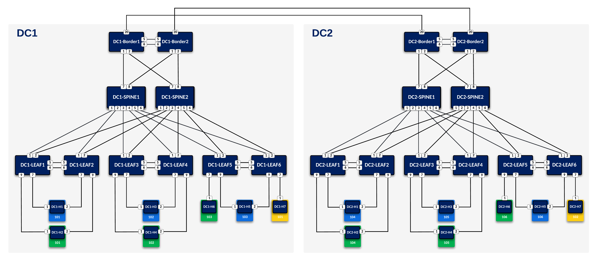

# L3LS DC Automation

This guide will go through the steps to fully configure a DC fabric from scratch using Infrastructure-as-Code
 - Ansible
 - Arista (AVD) 

### L3LS Topology

  

# FABRIC

## Table of Contents

- [Fabric Switches and Management IP](#fabric-switches-and-management-ip)
  - [Fabric Switches with inband Management IP](#fabric-switches-with-inband-management-ip)
- [Fabric Topology](#fabric-topology)
- [Fabric IP Allocation](#fabric-ip-allocation)
  - [Fabric Point-To-Point Links](#fabric-point-to-point-links)
  - [Point-To-Point Links Node Allocation](#point-to-point-links-node-allocation)
  - [Loopback Interfaces (BGP EVPN Peering)](#loopback-interfaces-bgp-evpn-peering)
  - [Loopback0 Interfaces Node Allocation](#loopback0-interfaces-node-allocation)
  - [VTEP Loopback VXLAN Tunnel Source Interfaces (VTEPs Only)](#vtep-loopback-vxlan-tunnel-source-interfaces-vteps-only)
  - [VTEP Loopback Node allocation](#vtep-loopback-node-allocation)

## Fabric Switches and Management IP

| POD | Type | Node | Management IP | Platform | Provisioned in CloudVision | Serial Number |
| --- | ---- | ---- | ------------- | -------- | -------------------------- | ------------- |
| FABRIC | l3leaf | dc1-borderleaf1 | 192.168.0.107/24 | vEOS-lab | Provisioned | - |
| FABRIC | l3leaf | dc1-borderleaf2 | 192.168.0.108/24 | vEOS-lab | Provisioned | - |
| FABRIC | l3leaf | dc1-leaf1 | 192.168.0.101/24 | vEOS-lab | Provisioned | - |
| FABRIC | l3leaf | dc1-leaf2 | 192.168.0.102/24 | vEOS-lab | Provisioned | - |
| FABRIC | l3leaf | dc1-leaf3 | 192.168.0.103/24 | vEOS-lab | Provisioned | - |
| FABRIC | l3leaf | dc1-leaf4 | 192.168.0.104/24 | vEOS-lab | Provisioned | - |
| FABRIC | l3leaf | dc1-leaf5 | 192.168.0.105/24 | vEOS-lab | Provisioned | - |
| FABRIC | l3leaf | dc1-leaf6 | 192.168.0.106/24 | vEOS-lab | Provisioned | - |
| FABRIC | spine | dc1-spine1 | 192.168.0.111/24 | vEOS-lab | Provisioned | - |
| FABRIC | spine | dc1-spine2 | 192.168.0.112/24 | vEOS-lab | Provisioned | - |

> Provision status is based on Ansible inventory declaration and do not represent real status from CloudVision.

### Fabric Switches with inband Management IP

| POD | Type | Node | Management IP | Inband Interface |
| --- | ---- | ---- | ------------- | ---------------- |

## Fabric Topology

| Type | Node | Node Interface | Peer Type | Peer Node | Peer Interface |
| ---- | ---- | -------------- | --------- | --------- | -------------- |
| l3leaf | dc1-borderleaf1 | Ethernet1 | spine | dc1-spine1 | Ethernet7 |
| l3leaf | dc1-borderleaf1 | Ethernet2 | spine | dc1-spine2 | Ethernet7 |
| l3leaf | dc1-borderleaf1 | Ethernet5 | mlag_peer | dc1-borderleaf2 | Ethernet5 |
| l3leaf | dc1-borderleaf1 | Ethernet6 | mlag_peer | dc1-borderleaf2 | Ethernet6 |
| l3leaf | dc1-borderleaf2 | Ethernet1 | spine | dc1-spine1 | Ethernet8 |
| l3leaf | dc1-borderleaf2 | Ethernet2 | spine | dc1-spine2 | Ethernet8 |
| l3leaf | dc1-leaf1 | Ethernet1 | spine | dc1-spine1 | Ethernet1 |
| l3leaf | dc1-leaf1 | Ethernet2 | spine | dc1-spine2 | Ethernet1 |
| l3leaf | dc1-leaf1 | Ethernet5 | mlag_peer | dc1-leaf2 | Ethernet5 |
| l3leaf | dc1-leaf1 | Ethernet6 | mlag_peer | dc1-leaf2 | Ethernet6 |
| l3leaf | dc1-leaf2 | Ethernet1 | spine | dc1-spine1 | Ethernet2 |
| l3leaf | dc1-leaf2 | Ethernet2 | spine | dc1-spine2 | Ethernet2 |
| l3leaf | dc1-leaf3 | Ethernet1 | spine | dc1-spine1 | Ethernet3 |
| l3leaf | dc1-leaf3 | Ethernet2 | spine | dc1-spine2 | Ethernet3 |
| l3leaf | dc1-leaf3 | Ethernet5 | mlag_peer | dc1-leaf4 | Ethernet5 |
| l3leaf | dc1-leaf3 | Ethernet6 | mlag_peer | dc1-leaf4 | Ethernet6 |
| l3leaf | dc1-leaf4 | Ethernet1 | spine | dc1-spine1 | Ethernet4 |
| l3leaf | dc1-leaf4 | Ethernet2 | spine | dc1-spine2 | Ethernet4 |
| l3leaf | dc1-leaf5 | Ethernet1 | spine | dc1-spine1 | Ethernet5 |
| l3leaf | dc1-leaf5 | Ethernet2 | spine | dc1-spine2 | Ethernet5 |
| l3leaf | dc1-leaf5 | Ethernet5 | mlag_peer | dc1-leaf6 | Ethernet5 |
| l3leaf | dc1-leaf5 | Ethernet6 | mlag_peer | dc1-leaf6 | Ethernet6 |
| l3leaf | dc1-leaf6 | Ethernet1 | spine | dc1-spine1 | Ethernet6 |
| l3leaf | dc1-leaf6 | Ethernet2 | spine | dc1-spine2 | Ethernet6 |

## Fabric IP Allocation

### Fabric Point-To-Point Links

| Uplink IPv4 Pool | Available Addresses | Assigned addresses | Assigned Address % |
| ---------------- | ------------------- | ------------------ | ------------------ |
| 10.255.200.0/22 | 1024 | 32 | 3.13 % |

### Point-To-Point Links Node Allocation

| Node | Node Interface | Node IP Address | Peer Node | Peer Interface | Peer IP Address |
| ---- | -------------- | --------------- | --------- | -------------- | --------------- |
| dc1-borderleaf1 | Ethernet1 | 10.255.201.177/31 | dc1-spine1 | Ethernet7 | 10.255.201.176/31 |
| dc1-borderleaf1 | Ethernet2 | 10.255.201.179/31 | dc1-spine2 | Ethernet7 | 10.255.201.178/31 |
| dc1-borderleaf2 | Ethernet1 | 10.255.201.181/31 | dc1-spine1 | Ethernet8 | 10.255.201.180/31 |
| dc1-borderleaf2 | Ethernet2 | 10.255.201.183/31 | dc1-spine2 | Ethernet8 | 10.255.201.182/31 |
| dc1-leaf1 | Ethernet1 | 10.255.201.153/31 | dc1-spine1 | Ethernet1 | 10.255.201.152/31 |
| dc1-leaf1 | Ethernet2 | 10.255.201.155/31 | dc1-spine2 | Ethernet1 | 10.255.201.154/31 |
| dc1-leaf2 | Ethernet1 | 10.255.201.157/31 | dc1-spine1 | Ethernet2 | 10.255.201.156/31 |
| dc1-leaf2 | Ethernet2 | 10.255.201.159/31 | dc1-spine2 | Ethernet2 | 10.255.201.158/31 |
| dc1-leaf3 | Ethernet1 | 10.255.201.161/31 | dc1-spine1 | Ethernet3 | 10.255.201.160/31 |
| dc1-leaf3 | Ethernet2 | 10.255.201.163/31 | dc1-spine2 | Ethernet3 | 10.255.201.162/31 |
| dc1-leaf4 | Ethernet1 | 10.255.201.165/31 | dc1-spine1 | Ethernet4 | 10.255.201.164/31 |
| dc1-leaf4 | Ethernet2 | 10.255.201.167/31 | dc1-spine2 | Ethernet4 | 10.255.201.166/31 |
| dc1-leaf5 | Ethernet1 | 10.255.201.169/31 | dc1-spine1 | Ethernet5 | 10.255.201.168/31 |
| dc1-leaf5 | Ethernet2 | 10.255.201.171/31 | dc1-spine2 | Ethernet5 | 10.255.201.170/31 |
| dc1-leaf6 | Ethernet1 | 10.255.201.173/31 | dc1-spine1 | Ethernet6 | 10.255.201.172/31 |
| dc1-leaf6 | Ethernet2 | 10.255.201.175/31 | dc1-spine2 | Ethernet6 | 10.255.201.174/31 |

### Loopback Interfaces (BGP EVPN Peering)

| Loopback Pool | Available Addresses | Assigned addresses | Assigned Address % |
| ------------- | ------------------- | ------------------ | ------------------ |
| 10.255.0.0/24 | 256 | 10 | 3.91 % |

### Loopback0 Interfaces Node Allocation

| POD | Node | Loopback0 |
| --- | ---- | --------- |
| FABRIC | dc1-borderleaf1 | 10.255.0.109/32 |
| FABRIC | dc1-borderleaf2 | 10.255.0.110/32 |
| FABRIC | dc1-leaf1 | 10.255.0.103/32 |
| FABRIC | dc1-leaf2 | 10.255.0.104/32 |
| FABRIC | dc1-leaf3 | 10.255.0.105/32 |
| FABRIC | dc1-leaf4 | 10.255.0.106/32 |
| FABRIC | dc1-leaf5 | 10.255.0.107/32 |
| FABRIC | dc1-leaf6 | 10.255.0.108/32 |
| FABRIC | dc1-spine1 | 10.255.0.100/32 |
| FABRIC | dc1-spine2 | 10.255.0.101/32 |

### VTEP Loopback VXLAN Tunnel Source Interfaces (VTEPs Only)

| VTEP Loopback Pool | Available Addresses | Assigned addresses | Assigned Address % |
| ------------------ | ------------------- | ------------------ | ------------------ |
| 10.255.1.0/24 | 256 | 8 | 3.13 % |

### VTEP Loopback Node allocation

| POD | Node | Loopback1 |
| --- | ---- | --------- |
| FABRIC | dc1-borderleaf1 | 10.255.1.109/32 |
| FABRIC | dc1-borderleaf2 | 10.255.1.109/32 |
| FABRIC | dc1-leaf1 | 10.255.1.103/32 |
| FABRIC | dc1-leaf2 | 10.255.1.103/32 |
| FABRIC | dc1-leaf3 | 10.255.1.105/32 |
| FABRIC | dc1-leaf4 | 10.255.1.105/32 |
| FABRIC | dc1-leaf5 | 10.255.1.107/32 |
| FABRIC | dc1-leaf6 | 10.255.1.107/32 |
